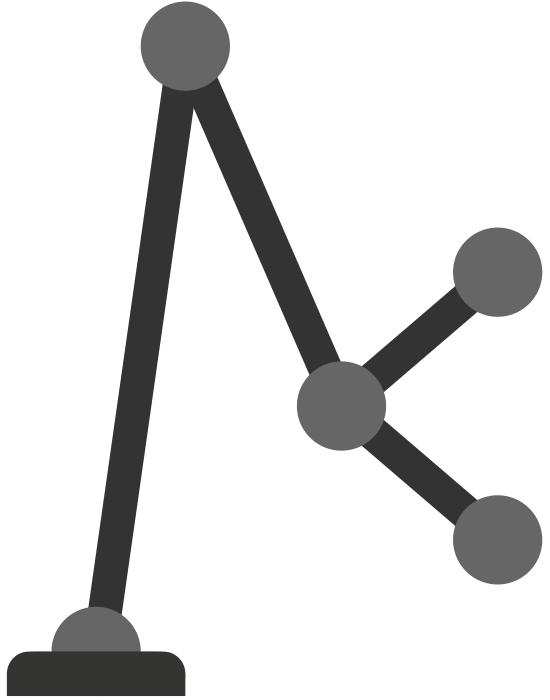

# Robot Forward Kinematic in Python 

---
# Dependencies

* [eigen](https://gitlab.com/libeigen/eigen)
* [sympy](https://github.com/sympy/sympy) 
* [wzk](https://github.com/scleronomic/WerkZeugKasten)

# Installation

1. install eigen 
   1. either use conda<br/>
      `conda install eigen`
      
   2. or specify the location of your version<br/>
      `export EIGEN_INCLUDE_DIR="your/path/to/eigen3"`

2. install rokin<br/>
`pip install git+https://github.com/scleronomic/rokin`


# Example with existing robots

```python
from rokin.Robots import JustinArm07
# Other available robots are JustinFinger03, JustinHand12, Justin19

robot = JustinArm07()  # The first time you call a robot, C++ code will 
                       # be generated. This may take a few seconds.
                       # Just run your scrip again. 
                       # Now everything should work

print(robot.n_dof)     # 
print(robot.n_frames)  # 
print(robot.limits)    # specify the lower and upper bound for each joint 
q = robot.sample_q(shape=100)  # Generates random configurations [shape x n_dof]
f = robot.get_frames(q)  # Calculates homogeneous matrices [n_frames x 4 x 4]
                         # for each configuration in q 
print(f[0, -1, :, :])
```

# Load and use your own robot
* TODO: load urdf file and create the respective C++ files via the python setup scripts
* Link those new scripts to the main library

# Future Work
* prismatic joints
* coupled joints
* custom joints
* visualize the robot with pyvista